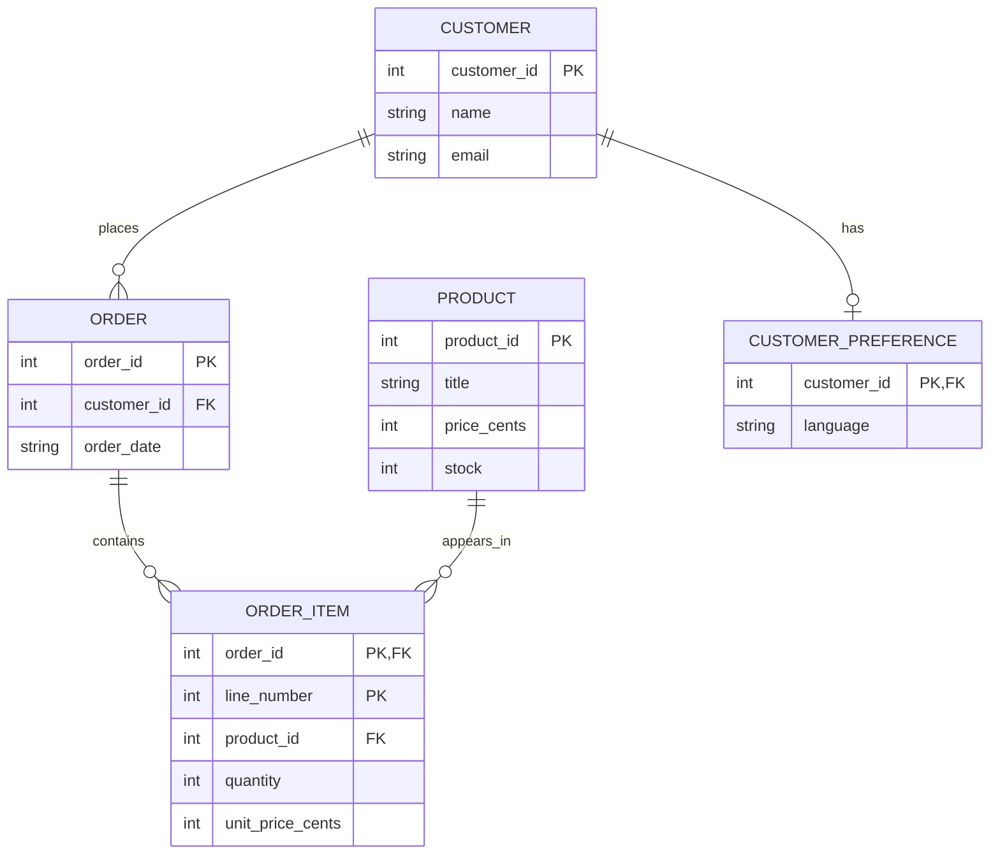

# Data Models: From Business Rules to Structures You Can Query

A **data model** describes which facts exist, how they relate, and which rules apply. Choosing a DBMS does not automatically create that model. PostgreSQL can store an excellent design or a confused one; a MongoDB document can group a useful record or duplicate facts that are difficult to maintain.

This note develops the bookstore into a complete relational example, then compares the hierarchical, network, entity-relationship, object-oriented, document, column-family, and graph models. The goal is to see how each represents the same kinds of questions, not to memorize a product taxonomy.

## 1. Separate three levels of decision

| Level | Question | Bookstore decision |
|---|---|---|
| Conceptual | What facts and rules does the business need? | An order belongs to a customer and contains purchased items |
| Logical | How will a chosen model represent them? | Use customer, order, product, and order-item tables |
| Physical | How will a particular engine implement access and storage? | Use SQLite integer identifiers and an index for customer-order lookups |

“An order has a customer” is a business fact. “Store `customer_id` as a foreign key” is a relational representation. “Index that column” is an access-path decision. Keeping them separate makes it easier to improve performance without changing what an order means.

## 2. Describe entities, attributes, and relationships

An **entity type** is a kind of thing tracked by the system; an **entity instance** is one actual occurrence. Customer is an entity type, while Alice is an instance. An **attribute** describes a fact about an entity, such as a customer's email or a product's title.

For this bookstore:

| Entity | Identifier | Important attributes |
|---|---|---|
| Customer | `customer_id` | Name, email |
| Product | `product_id` | Title, current price, stock |
| Order | `order_id` | Customer, date |
| Order item | Order identifier plus line number | Product, quantity, purchase price |

An order item is not just an implementation trick. It records the fact “this order bought this many units at this price.” Quantity belongs to that purchase, not to the product in general.

### Cardinality and optionality

**Cardinality** describes the permitted number of related instances. Ask the relationship question in both directions:

- One customer can place many orders; each order has one customer.
- One order contains many items; each item belongs to one order.
- One product can appear in many items; each item refers to one product.

**Optionality** describes whether participation is required. A registered customer can have zero orders. In this design, an order cannot have a missing customer. An order can be created before its lines are inserted inside a transaction, but a completed checkout should not leave it empty.

A foreign key can enforce the existence of the referenced customer. It does not automatically enforce “every order has at least one item.” That is an additional workflow invariant, requiring a deliberate implementation.

## 3. Draw an entity-relationship model

An **entity-relationship (ER) model** represents entity types, their attributes, and relationships. It is a way to reason about a domain, not a separate storage engine that competes with PostgreSQL or MongoDB.



Read `||` as exactly one, `o{` as zero or many, and `o|` as zero or one. The order-to-item edge permits an empty order at the storage level; the application can impose a stricter completed-checkout rule. The separate preference record is optional but unique to its customer.

An ER model can become a relational schema, document schema, or another representation. Translating it requires preserving the rules, not just copying entity names into collections.

## 4. Implement the relational model in SQLite

Run this full setup in a **fresh SQLite database**, independent of the smaller two-table introduction. Prices use integer cents to make the example's arithmetic exact within the chosen currency and unit.

```sql
PRAGMA foreign_keys = ON;

CREATE TABLE customers (
    customer_id INTEGER PRIMARY KEY,
    name TEXT NOT NULL,
    email TEXT NOT NULL UNIQUE
);

CREATE TABLE customer_preferences (
    customer_id INTEGER PRIMARY KEY REFERENCES customers(customer_id),
    language TEXT NOT NULL
);

CREATE TABLE products (
    product_id INTEGER PRIMARY KEY,
    title TEXT NOT NULL,
    price_cents INTEGER NOT NULL CHECK (price_cents >= 0),
    stock INTEGER NOT NULL CHECK (stock >= 0)
);

CREATE TABLE orders (
    order_id INTEGER PRIMARY KEY,
    customer_id INTEGER NOT NULL REFERENCES customers(customer_id),
    order_date TEXT NOT NULL
);

CREATE TABLE order_items (
    order_id INTEGER NOT NULL REFERENCES orders(order_id),
    line_number INTEGER NOT NULL,
    product_id INTEGER NOT NULL REFERENCES products(product_id),
    quantity INTEGER NOT NULL CHECK (quantity > 0),
    unit_price_cents INTEGER NOT NULL CHECK (unit_price_cents >= 0),
    PRIMARY KEY (order_id, line_number)
);

CREATE INDEX idx_model_orders_customer ON orders(customer_id);

INSERT INTO customers VALUES
    (1, 'Alice', 'alice@example.com'),
    (2, 'Bob', 'bob@example.com');
INSERT INTO customer_preferences VALUES (1, 'en');
INSERT INTO products VALUES
    (10, 'Database Basics', 1500, 5),
    (20, 'SQL Practice', 2500, 8);
INSERT INTO orders VALUES
    (101, 1, '2025-01-10'),
    (102, 1, '2025-01-12'),
    (103, 2, '2025-01-12');
INSERT INTO order_items VALUES
    (101, 1, 10, 2, 1500),
    (101, 2, 20, 1, 2500),
    (102, 1, 10, 1, 1500),
    (103, 1, 20, 2, 2500);
```

### How the three relationship types become declarations

The preference table's `customer_id` is both a primary key and a foreign key. It cannot repeat and must reference a customer, so each customer can have at most one preference row. There need not be a row for every customer.

The orders table's foreign key is not unique: several orders can contain the same customer identifier. That implements one-to-many.

Orders and products are many-to-many through `order_items`. One order can refer to several products, and a product can be referenced from several orders. `(order_id, line_number)` is a **composite primary key**. Both `(101, 1)` and `(102, 1)` are valid because line numbers are local to an order.

This key deliberately permits the same product on separate lines of one order. If the business requires one line per product, that is another uniqueness rule, not a consequence of the current key.

### Query the model, not a hand-built display

```sql
SELECT c.name, o.order_id, p.title,
       i.quantity, i.unit_price_cents,
       i.quantity * i.unit_price_cents AS line_total_cents
FROM orders AS o
JOIN customers AS c ON c.customer_id = o.customer_id
JOIN order_items AS i ON i.order_id = o.order_id
JOIN products AS p ON p.product_id = i.product_id
WHERE o.order_id = 101
ORDER BY i.line_number;
```

| name | order_id | title | quantity | unit_price_cents | line_total_cents |
|---|---|---|---|---|---|
| Alice | 101 | Database Basics | 2 | 1500 | 3000 |
| Alice | 101 | SQL Practice | 1 | 2500 | 2500 |

The item rows determine quantities and charged prices, while the product table supplies titles. The join pairs facts without changing their ownership.

Calculate totals for all orders:

```sql
SELECT order_id,
       SUM(quantity * unit_price_cents) AS total_cents
FROM order_items
GROUP BY order_id
ORDER BY order_id;
```

| order_id | total_cents |
|---|---|
| 101 | 5500 |
| 102 | 1500 |
| 103 | 5000 |

### Current facts and historical facts are different

Change the catalog's current price:

```sql
UPDATE products SET price_cents = 1700 WHERE product_id = 10;

SELECT p.price_cents AS current_price_cents,
       i.unit_price_cents AS purchase_price_cents
FROM order_items AS i
JOIN products AS p ON p.product_id = i.product_id
WHERE i.order_id = 101 AND i.line_number = 1;
```

| current_price_cents | purchase_price_cents |
|---|---|
| 1700 | 1500 |

The old order still charged 1500 per unit. This is intentional historical recording, not an accidental copy of the current price. If an invoice also needs the title as it appeared at purchase time, that may require a separate historical title. The correct ownership follows the business meaning of each fact.

## 5. Hierarchical models: navigate parent–child structure

A hierarchical model organizes records under parents. A basic tree has a root and one parent for each non-root node:

```text
Books
├── Computing
│   ├── Databases
│   └── Programming
└── Fiction
```

**IBM IMS** is a real hierarchical database technology. It represents database records through a root segment and dependent segments. Its native access model is not the SQL table example below. IBM's [hierarchy examples](https://www.ibm.com/docs/en/ims/15.5.0?topic=database-hierarchy-examples) show how business records follow segment relationships.

This organization suits a stable path such as parent record → dependent records. If an item naturally belongs to several independent parents, a simple tree needs additional modeling rather than pretending it has only one parent.

### Represent a tree in a relational engine

You do not need IMS to model the bookstore's category tree. Continue in the same SQLite database and add a table referencing itself:

```sql
CREATE TABLE categories (
    category_id INTEGER PRIMARY KEY,
    name TEXT NOT NULL,
    parent_id INTEGER REFERENCES categories(category_id),
    CHECK (parent_id IS NULL OR parent_id <> category_id)
);

INSERT INTO categories VALUES
    (1, 'Books', NULL),
    (2, 'Computing', 1),
    (3, 'Fiction', 1),
    (4, 'Databases', 2),
    (5, 'Programming', 2);

SELECT category_id, name
FROM categories
WHERE parent_id = 2
ORDER BY category_id;
```

| category_id | name |
|---|---|
| 4 | Databases |
| 5 | Programming |

This **adjacency list** stores the immediate parent. Find the entire Computing branch with a recursive query:

```sql
WITH RECURSIVE branch(category_id, name, depth) AS (
    SELECT category_id, name, 0 FROM categories WHERE category_id = 2
    UNION ALL
    SELECT c.category_id, c.name, b.depth + 1
    FROM categories AS c
    JOIN branch AS b ON c.parent_id = b.category_id
)
SELECT category_id, name, depth
FROM branch
ORDER BY depth, category_id;
```

| category_id | name | depth |
|---|---|---|
| 2 | Computing | 0 |
| 4 | Databases | 1 |
| 5 | Programming | 1 |

The first query starts the branch; the second repeatedly adds children. The schema prevents an immediate self-parent but not a longer cycle. Safe moves need additional rules and concurrency handling. The [hierarchical-data note](../03_sql/09_hierarchical_data.md) covers those cases and alternative representations.

## 6. Network models: follow predefined record connections

The historical **network database model** organizes records through named owner/member sets. A record can participate in multiple such relationship structures, allowing paths beyond one simple parent tree. **IDMS** is a named implementation; Broadcom's [owner/member example](https://knowledge.broadcom.com/external/article/209155/idms-considerations-for-new-database-rec.html) illustrates that its relationships are explicit database structures.

For a supplier catalog, imagine two navigational paths:

```text
Supplier A --supplies--> Book 10
Supplier B --supplies--> Book 10
Book 10    --belongs to--> Catalog group Computing
```

This can make predefined navigation natural in an existing application. It also couples access code to the paths and schema conventions. A modern graph database is related conceptually because relationships matter, but it is not simply a new name for the historical network model.

### Represent the same many-to-many fact relationally

Continue the SQLite example with a supplier and a relationship table:

```sql
CREATE TABLE suppliers (
    supplier_id INTEGER PRIMARY KEY,
    name TEXT NOT NULL
);
CREATE TABLE supplier_products (
    supplier_id INTEGER NOT NULL REFERENCES suppliers(supplier_id),
    product_id INTEGER NOT NULL REFERENCES products(product_id),
    PRIMARY KEY (supplier_id, product_id)
);

INSERT INTO suppliers VALUES (1, 'North Books'), (2, 'City Distribution');
INSERT INTO supplier_products VALUES (1, 10), (2, 10), (2, 20);

SELECT s.name
FROM suppliers AS s
JOIN supplier_products AS sp ON sp.supplier_id = s.supplier_id
WHERE sp.product_id = 10
ORDER BY s.supplier_id;
```

| name |
|---|
| North Books |
| City Distribution |

This is a relational implementation of the business relationship, not IDMS syntax. It demonstrates that the same domain fact can be represented through different logical models.

## 7. Object-oriented models: persist object state and identity

An object-oriented application represents domain concepts through classes, fields, and references. An **object database** persists those objects through its own object model. **ObjectDB** provides an example for Java with JPA access.

With a relational backend, an ORM maps objects to rows and relationships. With ObjectDB, the backend itself is an object database. Using an object-shaped API does not by itself establish which kind of database is underneath it.

**Encapsulation** keeps related state and behavior behind an object's interface: private fields can be exposed through methods such as `getTitle()`. **Inheritance** lets a specialized class extend a general one. A catalog application might represent `PrintedEdition` and `AudioEdition` as subclasses of `CatalogItem`, with page count and duration respectively. A persistence design must decide how subclasses, object references, and queries over a base type are represented.

```text
CatalogItem
├── PrintedEdition: pages, language
└── AudioEdition: duration, narrator
```

The hierarchy above is a programming-model illustration, not a database schema declaration. The runnable API example below uses one entity so that persistence and querying can be followed without also configuring inheritance.

### Define an ObjectDB entity and query it

The following is a small Java/Jakarta Persistence example. It requires ObjectDB and compatible `jakarta.persistence` dependencies from the provider's setup; it is not Java standard-library-only code. Save the entity as `Book.java`:

```java
import jakarta.persistence.Entity;
import jakarta.persistence.Id;

@Entity
public class Book {
    @Id
    private long productId;
    private String title;
    private int priceCents;

    protected Book() {}

    public Book(long productId, String title, int priceCents) {
        this.productId = productId;
        this.title = title;
        this.priceCents = priceCents;
    }

    public String getTitle() {
        return title;
    }
}
```

Use the entity in `ObjectModelDemo.java`, once with a fresh `chapter1_books.odb` file:

```java
import jakarta.persistence.EntityManager;
import jakarta.persistence.EntityManagerFactory;
import jakarta.persistence.Persistence;

public class ObjectModelDemo {
    public static void main(String[] args) {
        EntityManagerFactory factory =
            Persistence.createEntityManagerFactory("chapter1_books.odb");
        EntityManager manager = factory.createEntityManager();
        try {
            manager.getTransaction().begin();
            manager.persist(new Book(10, "Database Basics", 1500));
            manager.getTransaction().commit();

            for (Book book : manager.createQuery(
                    "SELECT b FROM Book b WHERE b.priceCents <= :maxPrice", Book.class)
                    .setParameter("maxPrice", 2000)
                    .getResultList()) {
                System.out.println(book.getTitle());
            }
        } finally {
            if (manager.getTransaction().isActive()) {
                manager.getTransaction().rollback();
            }
            manager.close();
            factory.close();
        }
    }
}
```

The expected printed title is `Database Basics`. `@Entity` marks persistable state, `@Id` declares identity, and `persist` schedules storage within the transaction. The query uses **JPQL**, referring to the entity and its Java fields rather than a SQL table declaration.

Objects are not stored together with executable method code. Their persistent state is stored, and the application supplies behavior through its classes. This approach can fit an object-centered workload but still needs transaction, schema-evolution, query, and integration decisions. See ObjectDB's [entity](https://www.objectdb.com/java/jpa/start/entity), [connection](https://www.objectdb.com/java/jpa/start/connection), and [CRUD](https://www.objectdb.com/java/jpa/start/crud) tutorials for the provider-specific setup and APIs.

## 8. Document models: choose a useful record boundary

A document can put an order and its bounded set of lines together:

```json
{
  "order_id": 101,
  "customer_id": 1,
  "order_date": "2025-01-10",
  "items": [
    { "product_id": 10, "quantity": 2, "unit_price_cents": 1500 },
    { "product_id": 20, "quantity": 1, "unit_price_cents": 2500 }
  ]
}
```

The record is shaped around “load one order with all its lines.” MongoDB can store and query this structure. The customer identifier is a reference rather than a copied current profile; the charged prices are historical facts.

Embedding trades independent row relationships for an aggregate record boundary. Ask whether lines grow within a manageable limit, whether they are edited together, and what reports need to search across them. Referencing other documents can avoid copying shared facts, but those references do not become SQL-style foreign keys merely because they look like identifiers.

The [types note](02_types_of_databases.md#2-document-databases-retrieve-a-record-with-nested-detail) provides a MongoDB insertion, query, and index example. A document model does not eliminate the need to define required fields, accepted types, or migration behavior.

## 9. Column-family models: plan the partition and ordering

For time-stamped customer events, Cassandra can use `(customer_id, month)` as a partition key and event time as a clustering key. The model groups “one customer's events in one month” as an efficient access unit.

```text
Partition: customer 1, month 2025-01
  2025-01-12 11:00 -> placed order 102
  2025-01-10 10:00 -> viewed product 10
```

This is a query-oriented logical model. An additional query by product across customers may need another representation. Key design must consider skew, growth, and the application's ability to maintain repeated facts. The [Cassandra example](02_types_of_databases.md#4-wide-column-databases-design-partitions-around-known-queries) supplies a complete CQL definition and inserts.

### See column families directly in HBase

Cassandra's CQL tables declare their columns. HBase exposes a different wide-column interface: families are declared, while qualifiers can be supplied for individual cells. With a running HBase instance, run these commands in the HBase shell using a fresh practice table:

```ruby
create 'chapter1_customer_events', 'profile', 'activity'
put 'chapter1_customer_events', 'customer:1', 'profile:name', 'Alice'
put 'chapter1_customer_events', 'customer:1', 'activity:order:101', 'placed'
put 'chapter1_customer_events', 'customer:1', 'activity:order:102', 'placed'
get 'chapter1_customer_events', 'customer:1'
```

The returned row has cells for `profile:name`, `activity:order:101`, and `activity:order:102`. Their displayed timestamps and formatting depend on the running system. Here `profile` and `activity` are families; `name` and `order:101` are qualifiers within them. The commands expose the column-family structure directly. Cassandra uses a different interface for the same broad family of databases.

The family layout and row-key choice affect storage and retrieval. A row with ever-growing activity would need a bounded-key design in a real system, such as time buckets, rather than an unlimited event history on one customer row. See the official [HBase reference guide](https://hbase.apache.org/book.html) and [shell guide](https://hbase.apache.org/docs/shell/).

The model differs from a columnar physical layout used to scan amounts for analytics. One describes how records are grouped and addressed; the other describes how values are organized for execution and storage.

## 10. Graph models: describe paths and relationship facts

In a property graph, entities become nodes, relationships become edges, and both can carry properties. Neo4j's customer-follow and book-like relationships can express a recommendation path directly:

```text
Alice --FOLLOWS--> Bob --LIKES--> Database Basics
```

A purchase relationship may have a quantity and a timestamp, but an order often still deserves its own node because it groups several lines and has its own lifecycle. Choosing a graph does not imply every business event should be squeezed into one generic edge.

The [Neo4j example](02_types_of_databases.md#6-graph-databases-make-traversal-a-first-class-operation) creates this graph and runs a Cypher pattern query. Multi-hop traversal is the motivating operation; identity, uniqueness, indexes, and path-expansion limits still require a design.

## 11. Decide which rules each representation preserves

| Business requirement | Relational example | Question in another representation |
|---|---|---|
| An order identifies a real customer | Foreign key plus required value | Who validates a referenced customer document or node? |
| One preference record per customer | Reference also made primary key | How is record or edge uniqueness enforced? |
| One order has several priced lines | `order_items` relationship entity | Are lines embedded or independently addressable? |
| Current price edits do not rewrite history | Separate current and purchase prices | Which document field or relationship property owns each fact? |
| A category move cannot create a cycle | Extra tree invariant beyond the foreign key | How does traversal detect or prevent an invalid path? |
| Events are queried by customer and month | Can be filtered and indexed | Does the partition scheme target that exact query? |

The choice affects how much the DBMS can enforce directly and how much transaction logic the application must supply. It also affects the cost of new queries and changes to relationships.

Model expected edge cases before optimizing: guest checkout, split shipments, refunds, multiple currencies, discounts, repeated products, or anonymization. This tutorial deliberately omits those features. They should be explicit extensions when needed, rather than hidden assumptions in the schema.

## Practice and check your understanding

1. Why does quantity belong on an order item rather than on the product record?
2. Which declaration makes customer preferences at most one-to-one?
3. Why can line number 1 appear in both orders 101 and 102?
4. After the price update, why does order 101 still use 1500 for product 10?
5. Can the category foreign key prevent every cycle? Explain a counterexample.
6. How is an ER diagram different from a database product?
7. Which supplier relationship is many-to-many, and how does the junction table encode it?
8. How does an object database differ from an ORM backed by relational tables?
9. Which request motivates embedding order lines, and which new request might make the design harder?
10. Identify a conceptual, logical, and physical decision in the example.

Continue with [requirements analysis](../02_database_design/01_requirements_analysis.md) to discover these rules systematically, then [normalization](../02_database_design/02_normalization.md) to reason about dependencies and repeated facts. Use the [glossary](05_glossary.md) to look up terms from this chapter.
